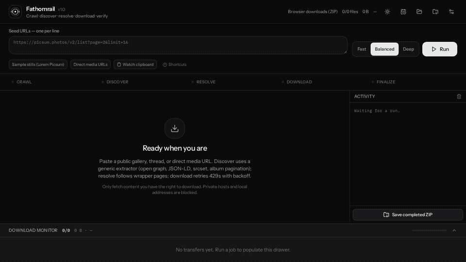

# Fathomrail

<p align="center">
  
</p>

<p align="center">
  <strong>Five-stage gallery downloader with a live monitor.</strong><br>
  Crawl → discover → resolve → download → verify.
</p>

Fathomrail is a desktop-class media downloader. Paste a public gallery, thread, or direct file URL. It crawls pages, discovers media (JSON feeds, Open Graph, JSON-LD, srcset, forum posts), resolves the real file, streams it with a live monitor, then SHA-256 verifies.

Inspired by the pipeline shape of [gallery-dl](https://github.com/mikf/gallery-dl), [yt-dlp](https://github.com/yt-dlp/yt-dlp), and [DOWNLOADER](https://github.com/Saiki1997/DOWNLOADER) — extractors, crawlers, resolvers, and downloaders — rewritten as an original TypeScript/React app plus an optional C# Avalonia desktop build.

> Only download content you have the right to fetch. Local and private hosts are blocked.

## Downloads

Windows x64 builds from [Releases](https://github.com/Saiki1997/Fathomrail/releases/tag/v1.2.0):

| File | What it is |
| --- | --- |
| `Fathomrail-Setup.exe` | Setup wizard — pick install folder, desktop + Start Menu shortcuts. This is the **same UI as the live preview** (Electron). |
| `Fathomrail-Portable.zip` | Extract and run `Fathomrail.exe` — no install, no registry |

## How to use



1. Paste one or more `https://` URLs (or drop them onto the composer).
2. Pick **Fast**, **Balanced**, or **Deep** crawl.
3. **Run**. Watch the stage rail and the download monitor.
4. Files pack into a ZIP (and/or a folder you pick). SHA-256 hashes appear per file.

Optional:

- **Watch clipboard** — copied URLs are appended (auto-run is a setting).
- **Cookie companion** — bookmarklet for non-HttpOnly cookies, or import a Chrome `cookies.txt` / JSON export. The Windows build can read Chrome’s profile directly.
- **Organize** — one folder, by post ID, by forum ID, or `forum/post`, with `001_` page order.
- **Scheduler + webhook** — repeat a job and POST JSON when it finishes.

Keyboard: `Ctrl+Enter` run · `Esc` stop.

## Features

| Area | What it does |
| --- | --- |
| Discover | `direct`, `json-feed`, `html-generic`, `forum-thread`, `album`, Open Graph, JSON-LD, `__NEXT_DATA__`, largest srcset, thumbnail collapse |
| Crawler | Pagination (`rel=next`, `page-N`), album-shaped paths, 429/503 backoff |
| Resolver | HEAD→GET, Content-Disposition names, referer, one hop through HTML wrapper pages |
| Downloader | Workers or in-order, per-host gap, bandwidth cap, retry with exponential backoff |
| Integrity | SHA-256 verify, skip known hashes, hash report export |
| UI | Dark / light / system, live monitor, ETA, job history |

## Requirements

**Web app (this repo)**

| | |
| --- | --- |
| Runtime | Node.js 22+ |
| Browser | Chromium, Chrome, Edge, or Firefox (folder picker + companion work best in Chromium) |
| Network | Public HTTPS pages only |
| Optional | Netscape `cookies.txt` or Chrome JSON cookie export for logged-in threads |

```bash
npm install
npm run dev
```

Then open the printed local URL. `npm run typecheck` checks the pipeline.

**Windows desktop (optional, `desktop/`)**

| | |
| --- | --- |
| SDK | .NET 8 |
| OS | Windows x64 (self-contained publish) |
| Optional | Google Chrome installed (direct cookie import) |

```bash
dotnet publish desktop/src/SimpDownloader.App/SimpDownloader.App.csproj -c Release -r win-x64 --self-contained true -p:PublishSingleFile=true
```

Two distribution formats:

- **Portable ZIP** — extract and run. No registry.
- **Setup Wizard EXE** — choose install directory, desktop + Start Menu shortcuts.

## Pipeline

```
URL  →  crawl  →  discover  →  resolve  →  download  →  finalize
              extractors     wrapper hop    monitor      SHA-256 + ZIP
```

Each discovered file is tagged with its extractor (`json-feed`, `direct`, …) in the monitor.

## Settings worth knowing

- Download location (browser folder picker when available)
- Organize by post / forum ID
- Number files in page order
- Bandwidth cap (KB/s) and max concurrent per host
- Finish webhook (HTTPS POST JSON with filenames + hashes)
- Light theme

## Legal

Fathomrail is a general-purpose downloader. It does not bypass paywalls or DRM. Use it only on media you are authorized to copy.

## License

MIT
